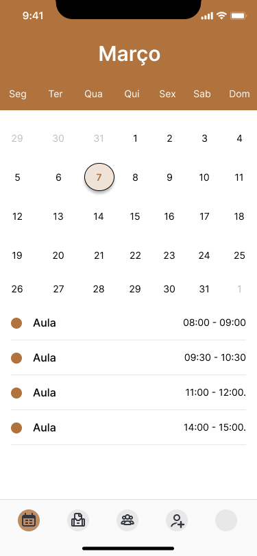
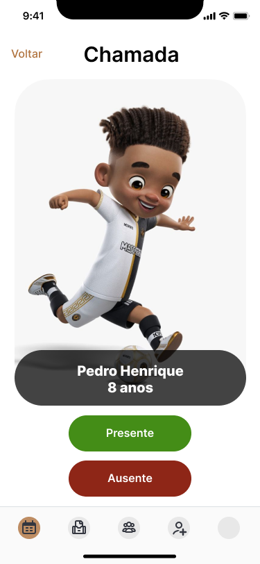
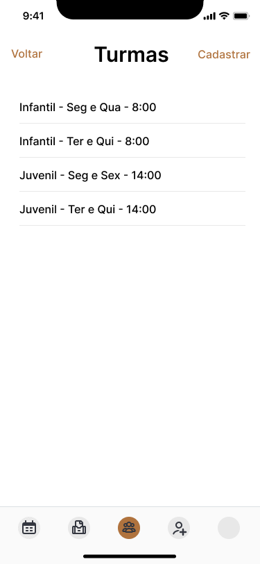
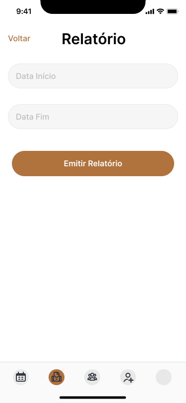

## Frequência Esportiva
Este projeto é dedicado ao desenvolvimento de um aplicativo para registro de frequência em modalidades esportivas, criado como parte do Projeto Estrela, uma iniciativa social sem fins lucrativos que busca promover atividades esportivas. Conheça mais sobre o Projeto Estrela em [https://www.instagram.com/projetoestrelaoficial](https://www.instagram.com/projetoestrelaoficial).

## Estrutura do Aplicativo

### 1. Tela Inicial

*Sign Up, Log In e Calendário*

Ao abrir o aplicativo, a tela inicial deve apresentar as seguintes opções:

- Registro de Frequência
- Cadastrar nova turma
- Cadastrar novo aluno
- Relatório mensal

### 2. Registro de Frequência

*Registro de Frequência e Início Chamada*

Ao selecionar "Registro de Frequência", o usuário deve escolher a data e, em seguida, a tela exibe uma lista de alunos com:
- Foto do aluno
- Nome do aluno
- Idade do aluno
- Botões para marcar "Frequente" ou "Ausente"

### 3. Cadastrar nova turma

- Campo para nome da turma
- Selecionar modalidade (dropdown)
- Botão para salvar

### 4. Cadastrar novo aluno

- Campo para nome do aluno
- Campo para idade do aluno
- Campo para foto do aluno (upload de imagem)
- Selecionar turma (dropdown)
- Botão para salvar

### 5. Ver Aluno

- Foto do aluno
- Nome do aluno
- Idade do aluno
- Turma do aluno
- Histórico de frequência
- Exclusão / Edição do Aluno

### 6. Relatório mensal

- Selecionar mês e ano
- Selecionar turma
- Botão para gerar relatório
- Exibição do relatório com a frequência dos alunos

## Como Contribuir

1. Faça um fork deste repositório.
2. Crie uma branch para sua feature (`git checkout -b feature/nome-da-feature`).
3. Faça commit das suas alterações (`git commit -m 'Adiciona uma nova feature'`).
4. Faça push para a branch (`git push origin feature/nome-da-feature`).
5. Abra um Pull Request.

## Estrutura do Código

- `src/`: Contém o código-fonte do aplicativo.
- `assets/`: Contém os arquivos estáticos como imagens e estilos.
- `ui-design/`: Contém os arquivos de design do Figma.
- `docs/`: Contém a documentação adicional.

## Requisitos

...

## Instalação

1. Clone o repositório: `git clone https://github.com/seu-usuario/frequencia-esportiva.git`
2. Entre na pasta do projeto: `cd frequencia-esportiva`
3. Instale as dependências: `npm install`
4. Inicie o aplicativo: `npm start`

## Licença

Este projeto está licenciado sob a Licença MIT - veja o arquivo [LICENSE](LICENSE) para mais detalhes.
